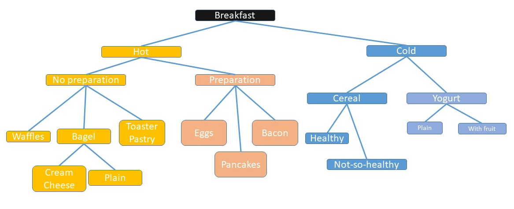

# Деревья решений

Концепция дерева решений довольно проста. Вы идете по тротуару, и подходите к углу. Здесь вы можете пойти направо, повернуть налево или идти прямо. Это ваше решение. После принятия решения – повернуть налево - у вас появляются новые решения, не такие как после решения повернуть направо. Каждое решение создает пути, которые ведут к другим решениям:

В этом дереве решений я решаю, что есть на завтрак каждое утро. Нужно ли мне сделать что-нибудь для этого или получить готовую еду из кладовой? Горячую или холодную? Полезную или нет?

Представим, что мы идем по тротуару и у нас есть цель. Мы не просто бесцельно бродим; мы пытаемся достичь какой-то цели. Одна или несколько комбинаций решений приведет нас к цели. Допустим, цель состоит в том, чтобы добраться до продуктового магазина, чтобы купить хлеб. Дальше возможно будет 4 или 5 дорог по различным тротуарам, которые приведут вас к магазину, но каждый путь может быть разным по длине. Если один путь идет вверх по холму, это может быть сложнее, чем идти по ровной дороге. Другой путь может заставить вас подождать на светофоре, что стоит вашего времени. Мы присваиваем значение каждому из этих атрибутов и обычно хотим выбрать путь с наименьшей стоимостью или с самой высокой наградой, в зависимости от проблемы.

Основная проблема типа дерева решений - это экспоненциальный рост. Давайте рассмотрим игру в шахматы - любимую задачу для искусственного интеллекта. У нас есть 20 вариантов для первого хода \(восемь пешек и два коня, каждый с двумя возможными ходами\). Каждый из этих 20 ходов приводит к 20 возможным следующим ходам и так далее. Таким образом, первый ход имеет 20 вариантов. Второй ход имеет 400 вариантов. Третий ход - 197 281 вариант. У нас очень быстро возникает большое дерево решений, когда мы попытаемся спланировать ходы заранее. Мы можем назвать каждый из этих возможных решений ветвью, положение, в котором мы находимся после принятия решения, является листом, и вся эта концептуальная структура - это дерево решений.

Позвольте мне подчеркнуть одну очень важную концепцию этой главы.

**!Подсказка!**  

**Секрет работы с деревьями решений заключается в том, чтобы безжалостно обрезать ветви, таким образом вы рассматриваете минимальное количество решений задачи.**

Есть два способа работы с деревом решений \(на самом деле, есть три – посмотрим, сможете ли вы угадать третий, прежде чем я объясню это ...\).

Первый способ - начать с самого начала и двигаться к своей цели. Ты можешь зайти в тупик, что вынуждает идти обратно или, возможно, начать заново. Мы будем называть это прямой цепочкой \(цепочкой, так как мы делаем идем от листа к листу \(которые связаны между собой\)\).

Другой способ - начать с цели и двигаться вниз по дереву к началу. Это обратная цепочка. Самое крутое в этой цепочке то, что мы рассматриваем гораздо меньше ветвей.  Вы можете догадаться, что главная проблема обратной цепочки – это то, что вы должны заранее знать о существовании всех листьев на дереве. Во многих ситуациях, например, поиск по сетке или планирование пути, это возможно. Это не работает в шахматах, где наблюдается экспоненциальный рост дерева.

Третий метод? Никто не говорит, что мы не можем сделать и то, и другое - мы могли бы объединить прямую и обратную цепочки и встретиться где-то посередине.

Выбор форм дерева решений, методов построения цепочек и построения основывается на:

·        Какие данные доступны?

·        Какая информация известна или неизвестна?

·        Как оценивается путь?

Существуют также различные виды решений для планирования пути и деревьев решений. Если бы вы были неограниченны в ресурсах, у вас был бы самый большой компьютер, совершенные знания, и готовность ждать сколь угодно, тогда вы могли бы сгенерировать оптимальный путь или решение.

Один из моих уроков, извлеченных за годы разработки практических роботов на основе ИИ и беспилотников, это то, что любое решение, которое отвечает всем критериям или целям, является приемлемым и пригодным для использования, и вам не нужно ждать и продолжать вычислять идеальное или оптимальное решение. Часто «достаточно хорошее» решение требует  1/10 или даже 1/100 от времени поиска оптимального решения. Оптимальное решение требует изнуряющего поиска, при котором, возможно, придется рассмотреть все возможные пути и комбинации.

